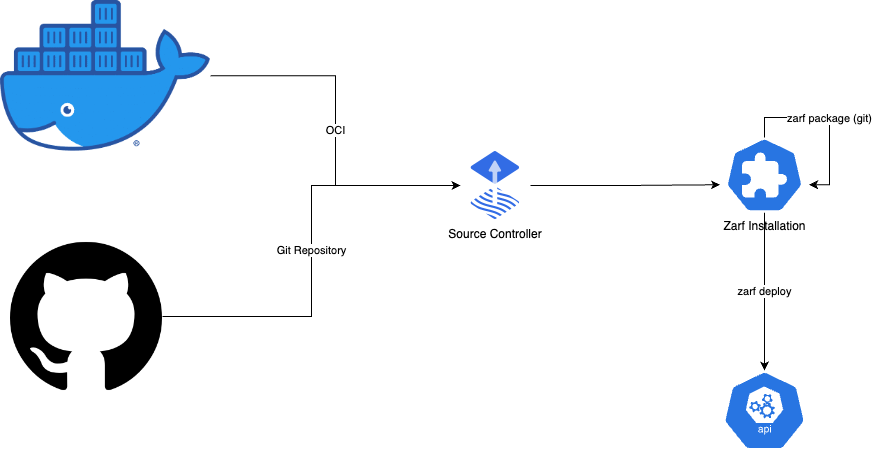

# zarf-controller

Build and deploy Zarf packages from a git repository or OCI Registry





## Issues

* Currently, only one Zarf package can be managed at a time based on on configs/state is currently managed in the Zarf package, there's bound to be race condition as different CRDs are being handled
* 

## Description
// TODO(user): An in-depth paragraph about your project and overview of use

## Getting Started
You’ll need a Kubernetes cluster to run against. You can use [KIND](https://sigs.k8s.io/kind) to get a local cluster for testing, or run against a remote cluster.
**Note:** Your controller will automatically use the current context in your kubeconfig file (i.e. whatever cluster `kubectl cluster-info` shows).

### Running on the cluster

N.B. - I've only gotten this working in-cluster on an AMD64 cluster, not an ARM cluster!!!


1. Zarf init you cluster

This wont be a step forever.  The vision is that when the controller starts running in the cluster it would run this command and continue to run zarf init each time it starts to ensure updates occur as versions of zarf get updated.

```sh
zarf init -a amd64 --confirm
```

```sh
➜  zarf-controller k get pods -n zarf
NAME                                    READY   STATUS    RESTARTS   AGE
agent-hook-7b4b5947cd-z4bxd             1/1     Running   0          2m10s
agent-hook-7b4b5947cd-lt94s             1/1     Running   0          2m10s
zarf-docker-registry-768f588b5d-qk82m   1/1     Running   0          22s
```
	
2. Deploy the controller to the cluster with the image specified by `IMG`:

```sh
make -B zarf # forces rebuild of zarf package
make zarf-deploy
kubectl get pods -n zarf-controller-system
```

4. Install an example

While doing these examples it might be good to look at the controller logs and the pods in the zarf namespace

```sh
stern -n zarf-controller-system .
```

and

```sh
watch kubectl get installations,gitrepositories,helmrepositories,pods -A
```


4.a Doom via Git

In this example the controller watches a particular Zarf.yaml file stored in git, downloads the file, builds the package and then deploys the package:

```sh
kubectl apply -f examples/doom-git.yaml
```


4.b Doom via OCI
remember to delete the git version before deploying this

```sh
kubectl apply -f examples/doom-oci.yaml
```


### Uninstall CRDs
To delete the CRDs from the cluster:

```sh
make uninstall
```

### Undeploy controller
UnDeploy the controller to the cluster:

```sh
make undeploy
```

## Contributing
// TODO(user): Add detailed information on how you would like others to contribute to this project

### How it works
This project aims to follow the Kubernetes [Operator pattern](https://kubernetes.io/docs/concepts/extend-kubernetes/operator/)

It uses [Controllers](https://kubernetes.io/docs/concepts/architecture/controller/) 
which provides a reconcile function responsible for synchronizing resources untile the desired state is reached on the cluster 

### Test It Out
1. Install the CRDs into the cluster:

```sh
make install
```

2. Run your controller (this will run in the foreground, so switch to a new terminal if you want to leave it running):

```sh
make run
```

**NOTE:** You can also run this in one step by running: `make install run`

### Modifying the API definitions
If you are editing the API definitions, generate the manifests such as CRs or CRDs using:

```sh
make manifests
```

**NOTE:** Run `make --help` for more information on all potential `make` targets

More information can be found via the [Kubebuilder Documentation](https://book.kubebuilder.io/introduction.html)

## License

Copyright 2022.

Licensed under the Apache License, Version 2.0 (the "License");
you may not use this file except in compliance with the License.
You may obtain a copy of the License at

    http://www.apache.org/licenses/LICENSE-2.0

Unless required by applicable law or agreed to in writing, software
distributed under the License is distributed on an "AS IS" BASIS,
WITHOUT WARRANTIES OR CONDITIONS OF ANY KIND, either express or implied.
See the License for the specific language governing permissions and
limitations under the License.

